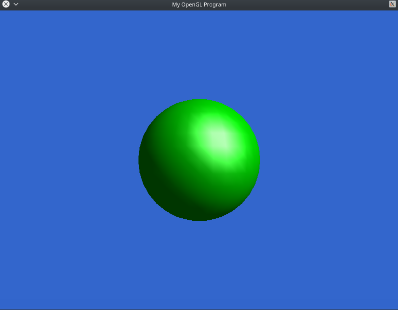

### HW0.5

This is the program for HW0.5 of CSci 5607 Fundamentals of Computer Graphics.

This is a collection of several mini SDL+OpenGL demos.

### Usage

    mkdir build
    cd build
    cmake ..
    make
    
  Eight programs will be complied.
  
  + `BlankScreenSDL`: just a blank, blue window
  + `Cube3D`: a rotating cube without depth test
  + `CubeLit` and `CubeLit1VBO`: a rotating cube with depth test
  + `ModelLoad`: a 3D model loader and displayer
  + `TriangleColored`: a colorful triangle
  
  The above six programs are those provided.
  
  + `ModelLoadNew <model_file>`: a 3D model loader controllable by keyboard
  
    + `1`: Phong shading
    + `2`: Blinn-Phong shading
    + `3`: Gouraud shading
    + `w, s`: translate up and down
    + `a, d`: translate left and right
    + `z, x`: translate forward and backward
    + `q, e, c`: rotate around each axes
    
  + `TriangleColoredNew`: a colorful triangle controllable by keyboard
  
    Color changed randomly when releasing a key.
    
### Demo

  
  
  
  
  
  
  
  
  
  
### Shading

  Phong shading
  
  
  
  Blinn-Phong shading
  
  
  
  Gouraud shading
  
  
  
### Interactive Demos
  
  

  

### Summaries

  This homework is much easier compared to the former two. However, it helps me review the basic usage of SDL and OpenGL. I cannot wait for the last project.

