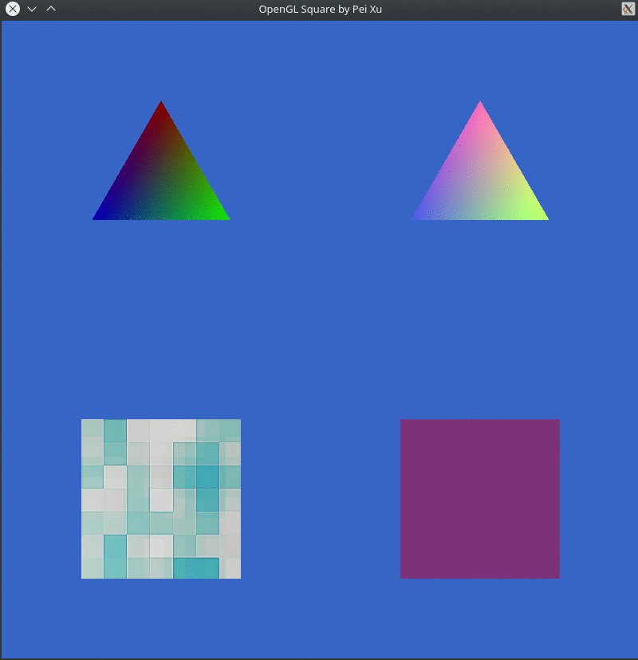

## HW0                                                                                    

This is the code for HW0 of CSci 5607 Fundamentals of Computer Graphics, UMN. This is a improved version of code for HW0, which implements all requried and extra features.                                                                      

A basic version, which is obtained by directly adding code the specified location in the provided demo code and which only implements the basic features, is at

<https://github.com/xupei0610/ComputerGraphics-HW/tree/master/hw0_demo>

## Usage

    mkdir build
    cd build
    cmake ..
    make
    ./hw0

## Description                                                                            

This code implements a basic interactive GUI using SDL2 and OpenGL.

It draws 4 basic 2D shapes (Extra Feature 3 and 6), and supports 3 kinds of interaction for each shape.

+ Translation: drag mouse at any position inside a shape
+ Scaling: drag mouse at any position on the edge of a shape
+ Rotation: drag mouose at any corner of a shape

Mouse cursor changes when different interaction is available. (Extra Feature 4)

+ Mouse at corner (`SDL_SYSTEM_CURSOR_CROSSHAIR`)

  
+ Mouse on the edge (`SDL_SYSTEM_CURSOR_HAND`)

  
+ Mouse at the interior (`SDL_SYSTEM_CURSOR_SIZEALL`) 

  

Some margin is considered when checking the location of mouse cursor relative to a shape so that the user does not need to put the mouse cursor on the edge or at the corner exactly.

Each shape has its own fragment shader:

+ For the top-left triangle, its color changes automatically. (Extra Feature 5)
+ For the top-right triangle, its color changes based on its location relative to the window.
+ For the bottom-left square, it has a uniform texture. (Extra Feature 2)
+ For the bottom-right square, it has a uniform color with auto changeable transparancy. (Extra Feature 5)   

Shapes will not change their aspect ratio when that of the window changes. (Extra Feature 7)

 

When clicked, a shape will be selected and become the one on the top most.

When the user clicks on any empty space, the selected shape will move toward the clicked position automatically.

Keyboard events: (Extra Feature 1)
+ `1`: select the top-left triangle
+ `2`: select the top-right triangle
+ `3`: select the bottom-left square
+ `4`: select the bottom-right square
+ `0`: select all shapes
+ `w` or `Up`: selected shape(s) moves up
+ `s` or `Down`: selected shape(s) moves down
+ `a` or `Left`: selected shape(s) rotates left
+ `d` or `Right`: selected shape(s) rotates right
+ `q`: selected shape(s) moves toward left
+ `e`: selected shape(s) moves toward right
+ `z` or `+`: selected shape(s) zooms in
+ `x` or `-`: selected shape(s) zooms out
+ `f`: toggle fullscreen
+ `Esc`: quit

## Troubles during coding
This is my first time to write OpenGL code. Benefiting from the courses related to computer vision, it was not a problem to consider the rotation problem. However, it took me some time to adapt the programming style of OpenGL, which is designed as a huge state machine and is much different to most libraries I met before.

## Interesting Image

Twirling Shapes

<https://github.com/xupei0610/ComputerGraphics-HW/tree/master/hw0/interest.gif>

These twirling shapes were caused by a bug when doing rotation.

