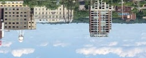

## HW1
This is the code for HW1 of the course CSci5607 Fundamentals of Computer Graphics, UMN.

This homework focuses on some basic image processing techniques.

It implements all the required and etrac features stated in the assignment.

Some functions are packaged in the file `extra.hpp`. Convolution are implemented through `im2col`.

## Compile

    mkdir build
    cd build
    cmake ..
    make

## Usage

See

    ./image -help

## Description

The program `image` provides some manipulations to process image. All the supported functions are listed below, while the above picture is the original picture of the following demos.

### Brighten

Opt: `-brightness <factor>` Arg Range: `[-1, 1]`

Adjust brightness in HSL color space.

Usage example:

    ./image -input ../sample/millcity.jpg -brightness 0.8 -output out.png

Effect: `-brightness` `-0.2`, `0.2`, `0.5`

  

### Contrast

Opt: `-contrast <factor>` Arg Range: `[-1, 1]`

Adjust contrast based on the average grayscale of the whole picture. When `<factor>` is equal to or lower than -1, then the new picture will be the color of the average grayscale. When `<factor>` is equal to or greater to 1, then the new picture **usually** will consist of at most 3^2 kinds of color. The adjustment is not really linear w.r.t the argument.

Effect: `-contrast` `-0.2`, `0.5`, `1`

  

## Saturation

Opt: `-saturation <factor>` Arg Range: `[-1, 1]`

Adjust saturation in HSL color space.

Effect: `-saturation` `-1`, `0.5`, `1`

  

### Channel Extraction

Opt: `-extractChannel <channel no>`

Extract specific channel(s). `1` represents the R channel, `2` represents G channel, `4` represents B channel, `8` represents the alpha channel. Use `|` (`+`) operation to extract multiple channels.

Effect: `-extractChannel` `2`, `4`, `3`

  

### Crop

Opt: `-crop <x> <y> <width> <height>`

Crop image. `<x>` and `<y>` count from 0 or -1. When `<width>` or `<height>` is less than 0, the image will be the cropped from right to left or from bottom to top.

Effect: `-crop` `300 200 250 100`, `550 300 -250 -100`, `-300 -200 250 100`

  

### Random Noise

Opt: `-noise <factor>` Arg Range: `(-infinity, +infinity)`

Add Gaussian noise with `mu = 0` and `sigma = 1`. `<factor>` decides the amplitude gain of the noise.

Effect: `-noise` `-20`, `20`, `50`

  

### Blurring

Opt: `-blur <maskSize>` Arg Range: positive, odd integer

Gaussian blurring with `mu = 0`, `sigma = 0.3 * ((maskSize-1)*0.5 - 1) + 0.8`. 

Effect: `-blur` `3`, `7`, `11`

  

with `-crop 300 200 250 100`

  

### Sharpening

Opt: `-sharpen <maskSize>` Arg Range: positive, odd integer

Sharpening the pricute by extrapolating the original image from the median-blurred version of the orignial image.

Effect:

`-sharpen` `3`, `7`, `11`

  

with `-crop 300 200 250 100`

  

### Edge Detection

Opt: `-edgeDetect`

Detect edges by Canny edge detector. The image will be converted into a grayscale one before detecting.

Effect: `-edgeDetect`

### Quantization

Opt: `-quantize <nbits>` Arg Range: `1`, `2`, `3`, `4`, `5`, `6`, `7`
 
Use `<nbits>` data to quantize the color in each channel, i.e. map `0~255` to a n-bit data space. When `<nbits>` is equal to 1, then there will be at most 3^2 kinds of color in the new picture.

Effect: `-quantize` `1`, `2`, `4`

  

### Random Dithering

Opt: `-randomDither <nbits>` Arg Range: `1`, `2`, `3`, `4`, `5`, `6`, `7`

Random dithering with n-bit quantization

Effect:

`-randomDither` `1`, `2`, `4`

  

with `-crop 300 200 250 100`

  

### Ordered Dithering

Opt: `-orderedDither <nbits>` Arg Range: `1`, `2`, `3`, `4`, `5`, `6`, `7`

Ordered dithering with n-bit quatization and the 4x4 Bayer matrix.

Effect:

`-orderedDither` `1`, `2`, `4`

  

with `-crop 300 200 250 100`

  

### Floyd-Steinberg Dithering

Opt: `-FloydSteinbergDither <nbits>` Arg Range: `1`, `2`, `3`, `4`, `5`, `6`, `7`

Floyd-Steinberg Dithering with n-bit quantization

Effect:

`-FloydSteinbergDither` `1`, `2`, `4`

  

with `-crop 300 200 250 100`

  

### Scaling 

Opt: `-scale <sx> <sy>` Arg Range: `[0, 1] x [0, 1]`

Use `-sampling <method no>` before `-scale` to set sampling method. The default sampling method is the nearest point method. Supported sampling methods include `0` the nearest point interpolation, `1` bilinear interpolation, and `2` the Gaussian sampling method.

Usage example:

    ./image -sampling 1 -scale 0.28 0.28

Effect:

`-scale 0.28 0.28` with `-sampling` `0` (nearest point), `1` (bilinear) and `2` (Gaussian) respectively

  

`-crop 350 250 50 20 -scale 5 5` with `-sampling` `0`, `1`, `2`

  

### Rotation

Opt: `-rotate <angle>` Arg Range: `[-180, 180]`

Rotate the picture clockwise. Use `-sampling <method no>` to set sampling method.

Effect: `-rotate` `-90`, `90`, `120`

  

### Fun

Opt: `-fun`

Water rippling effect using the polar coordinate and the warpping function `alpha * r * sin(beta*r)`. Use `-sampling <method no>` to set sampling method.

Effect: `-fun`

  

## Extra Features

### Nonphotorealistic Rendering

Opt: `-watercolor`

Watercolor painting effect. By default, the program uses openMP to accelerate meanshift filtering, abstraction and adding Perlin noise.

Process:
+ Color Adjustment: adjust the whole picture's color mean and std. deviation in Lab color space.
+ Abstraction: reduce picture details by meanshift filtering and merging close color.
+ Edge Wobbling: use Perlin noise to perform edge wobbling effect of watercolor inks.
+ Edge Darkening: simulate the dark edge after watercolor inks' evaporation.
+ Pigment Dispersion: use Gaussian noise to simulate the effect of pigment dispersion.
+ Texture: merge the processed picture with a watercolor canvas texture.

The above process is a little **time-consuming**.

References:

Wang M, Wang B, Fei Y, et al. *Towards photo watercolorization with artistic verisimilitude*[J]. IEEE transactions on visualization and computer graphics, 2014, 20(10): 1451-1460.

Effect: `-watercolor`

### Lossy Compression

**This is just for fun.** Basically, useless compared to some other image compression algorithms.

This method, basically, is a combination of quantization and run-length encoding.

In the compressed file, the fist 5-byte data are a signature: `PXIMG`.

The following 16-byte data are 4 32-bit integers. They, in order, represent the API version, the image height, the image width, and the image channels.

The following data are the compressed image data stored channel by channel. The first two bytes in the data of a channel, is the `min` and `max` color values among those in the channel. Then for each byte in the following compressed data, the lower 4-bits is used to represent a color while the higher 4-bits to represent the occurance of that color before another color is encountered or before the occurance reaches 16. For example `0x0F` represents that the color `F` appears 1 times.

Differing from directly using quatization, `min` and `max` values are used for verification and to improve the color space volume that can be presented by 4 bits. Each color is compressed to 4 bits by

    0x0F & ((color - min)/interval)

where `interval = max-min > 15 ? (max-min)/15 : 1`.

Each compressed color data can be uncompressed to 8 bits by

    (0x0F & compressed_color_data)*interval

and the occurance of that color can be exracted out by

    compressed_color_data >> 4

A special case is that `min` is equal to `max`. In that case, no image data of that channel will be written into the file.

Usage example:

    ./image -input ../sample/millcity.jpg -output out.px
    ./image -input out.px --output out.png

Effect: which is not worse than that obtained by processing the original image using `-quantize 4`

Size reduces from `1819854` (BMP format) to `530012` bytes.

## Artistically Interesting Image

Watercolor painting stylization transfer. See the [orignal picture](doc/interest_org_picture.jpg).

## Summaries

This homework is a fantastic experience. I, once again, saw the magic of using numerical operation to process image, which is usually thought of as abstract. I did something about image processing and computer vision in C++. Therefore, most parts fo this homework is not much hard for me. The really difficult one is to implement the extra feather -- nonphotorealistic rendering. It took me lots of time to explore how to transfer an image into the watercolor painting style and to test the proper value of each parameter. In order to realize this feature, I implement meanshift filtering, Perlin noise generation and RGB-Lab color space conversion, which I usually use through calling corresponding functions from the libraries like OpenCV. The final result is not perfect but still satisfactory.

