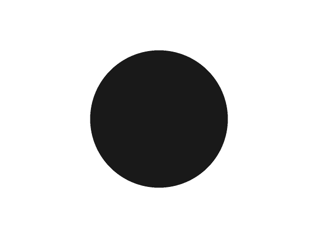
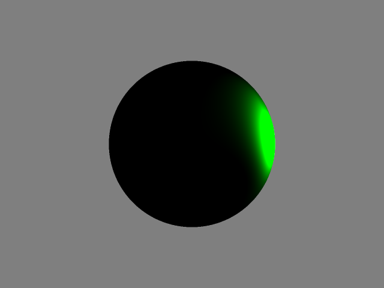
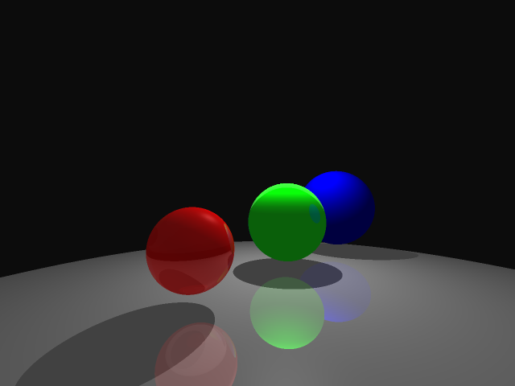
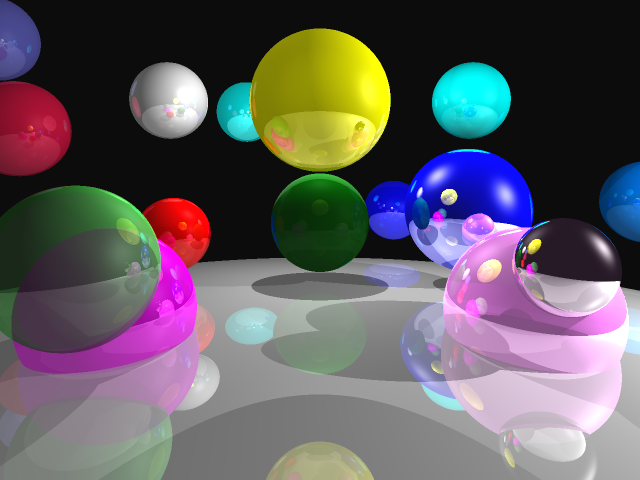
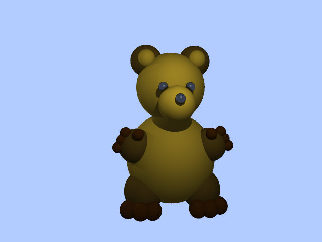
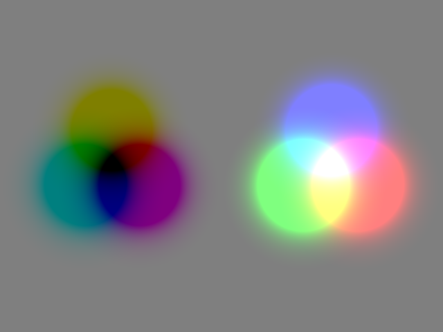

## HW2

This is the script for HW2 of the course CSci 5607 the Fundamentals of Computer Graphics.

The code implements all the requried basic features and most extra features, except for Constructive Solid Geometry, Motion Blur, Depth of Field and objects with Triangle shape.

## Usage

    mkdir build
    cmake ..
    make
    ./hw2

The program `hw2` accepts one argument to load a specific scene file. By default, without any argument, the program will load the scene defiend in `./scenes/spheres1.scn`.

A new supported property in scene files is added to set sampling radius for supersampling.

    sampling_radius <non-negative integer>

When the parameter is 0, no supersampling will by performed.

To use Jitter supersampling, use `-DJITTER=<positive integer>` when in the `cmake` command. Then `<positive integer>` represents all many samples will be collected in a subspace whose size is decided by the sampling radius.

To use Adapative supersampling, use `-DADAPTIVE`. If no `JITTER` is defined, `ADAPTIVE` will perform Jitter sampling 5 times in a sub sampling space.

Set `-DUSE_GUI=OFF` or close the option in the `CMakeLists.txt` file to disable GUI, if it is a trouble to use SDL2 with CMake.

## Demos
The follwing shows demos from scenes in the `sences` folder.

All the above images are generated by supersampling uniformly within a 2x2 sampling region for each pixel.

## Art Contest

Negative Light vs Positive Light

This picture is generated using six spot light sources, three of which are normally RGB light and the other three have negative light. The negative light works like YMYK color, which should looks better if the background is purely white.

The scene file is `interest.scn`.

## Summaries

This homework is challenging, while the time is quite pressing to complete all basic and extra features. I originally planed to make the program runnable in real time. However, I found it is difficult to achieve this goal with only CPU even using multi-threading technique. `spheres1.scn` is the worst case, which needs 400ms in my desktop computer to finish the ray tracing with the max recusive depth 5. I am trying to make an interative scene using ray tracing, in which the user can use mouse or/and keyboard to move camera and visit the virtual world. I hope this could be done in the next homework. Maybe GPU is needed to finish this task. I will try.

