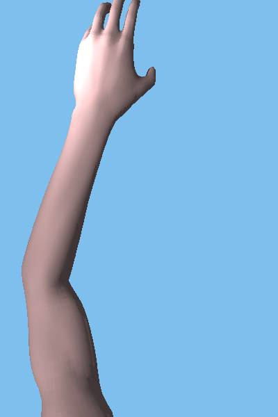
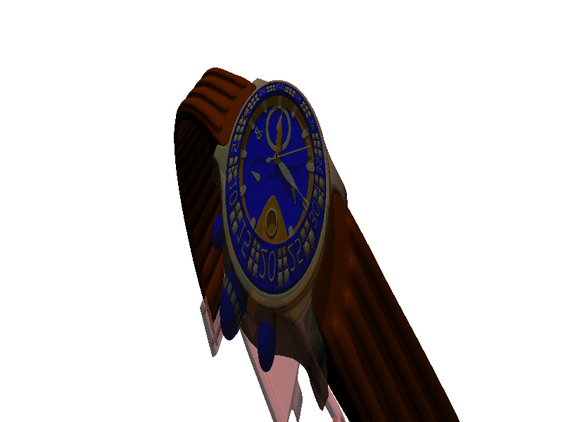
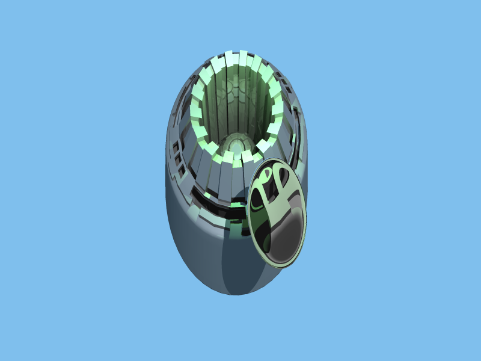
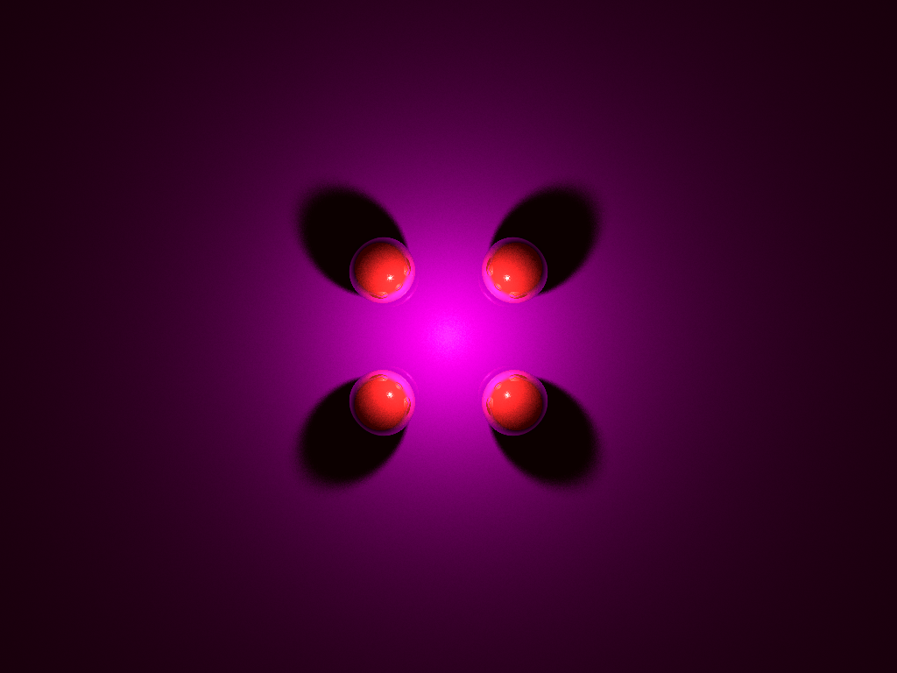

This is the scripts for HW3 of CSci5607 Computer Graphics, UMN, Fall 2017.

This implements a ray tracing program.

Apply one day to write the README file. T_T. This will be finished in the afternoon of Oct. 30th after the exam.

### Usage

    mkdir build
    cd build
    cmake ..
    make
    ./hw3

CMake Compile Options:

  + `USE_GUI`: enable GUI using SDL2, default: `ON` 
  + `USE_OPENMP`: enable OpenMP, default: `ON`
  + `USE_CUDA`: enanble CUDA, default: `ON`
  + `USE_JITTER=<n>`: enable Jitter supersampling, `n` is the number of samplings per pixel; default: `OFF`. No GPU support for Jitter supersampling due to performance reason.
  + `USE_ADAPATIVE`: enable adaptive supersampling`. This function is done, but not so smart.  

This code is tested under Ubuntu 16.04 with CUDA 8 and GTX1080 Ti and MacOS 10.12 with CUDA 9 and GT650M (it is an old laptop, XD).

Attention: This code is not tested under Windows!! My Windows laptop broke last week. It is still on the way sending to the Product Service Center located in Texas. T_T

### Features List

#### CUDA support

  This program support GPU computation using CUDA. If the program is compiled with the `USE_CUDA` option, the program will render using GPU by default. If CPU computation is preferred, put

    mode cpu

  in the scene file to enable CPU computation.

  I uses stack instead of recursion in the GPU code to prevent using too much registers by a GPU thread. However, there is still two problems using GPU computation in the program.
  
  1. No bound box support. So far, the bound box structure is allowed to be put into another bound box such that a deep function call may be involved when using bound box or other composition structure and cause the GPU kernel crashing. I have got an idea to flatten the warping of bound box. I will revise this problem later.
  2. Object Initialization. The CPU code is written in modern C++ design pattern original. Lots of virtual functions are used, which cause a huge problem when directly using them on GPU. In order to use virtual functions, objects must be initialized on the device (GPU) directly instead of copying it from the host to device directly. I will talk about it in details in the summary section. This is the flaw of my code design. I will modify the code later, by maintaining function pointers like `vtable` manually, to verify this problem.

#### GUI with progress bar (approximation)
#### Progress bar in CMD mode
#### Responsable during rendering
#### Many Geometries 
#### Many Materials
#### Transformation
#### Area Light
#### Supersampling
#### Monte-Carlo Integration for indirect diffuse
#### BoundBox
#### and more.

`2832ms` using GPU

using a bound box, BVH with Octree will be implemented later.
There are some problems to render this scene using GPU. I will talk about it later in the summary section.

with 5x5 supersampling

Soft Shadow

