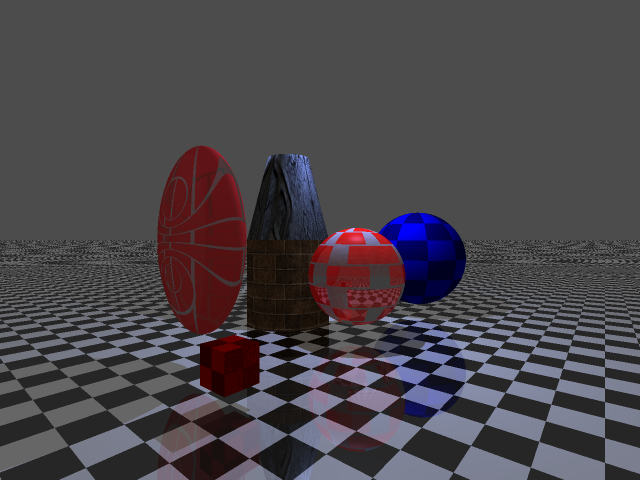

Apply one more day to write the readme...

### Features List

#### CUDA support
#### GUI with progress bar (approximation)
#### Progress bar in CMD mode
#### Responsable during rendering
#### Many Geometries 
#### Many Materials
#### Transformation
#### Area Light
#### Supersampling
#### Monte-Carlo Integration for indirect diffuse
#### BoundBox
#### and more.

