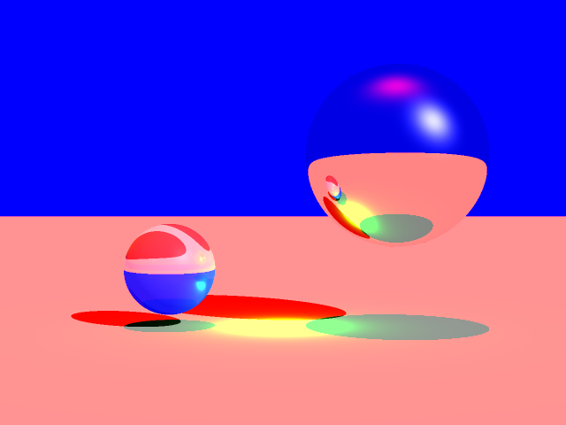
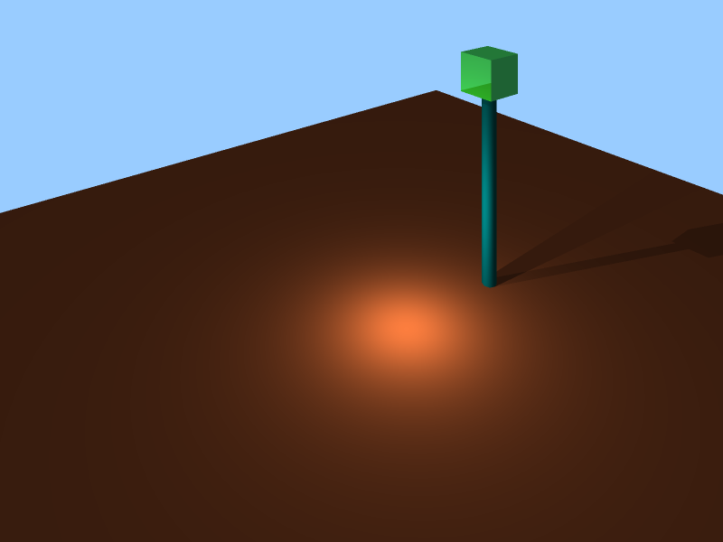
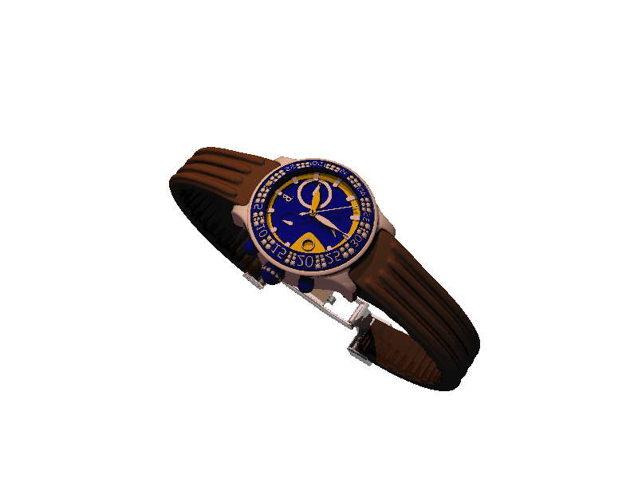

This is the scripts for HW3 of CSci5607 Computer Graphics, UMN, Fall 2017.

This implements a ray tracing program.

### Usage

    mkdir build
    cd build
    cmake ..
    make -j 8
    ./hw3

CMake Compile Options:

  + `USE_GUI`: enable GUI using SDL2, default: `ON`
  + `USE_OPENMP`: enable OpenMP, default: `ON`
  + `USE_CUDA`: enanble CUDA, default: `ON`
  + `USE_JITTER=<n>`: enable Jitter supersampling, `n` is the number of samplings per pixel; default: `OFF`. No GPU support for Jitter supersampling due to performance reason.
  + `USE_ADAPATIVE`: enable adaptive supersampling. This function is done, but not so smart.  

This code was tested under Ubuntu 16.04 with CUDA 8/9 and GTX1080 Ti, Windows 10 with CUDA 9 and GTX1080, and MacOS 10.12 with CUDA 9 and GT650M (it is an old laptop, XD).

I strongly recommend not to compile this program using MSVC. It thoroughly is a physical and mental suffering to configure CMake + MSVC + CUDA + SDL. You may need to modify the `MSVC_CL_EXE` in the `CMakeLists.txt` file to set the host compiler correctly for CUDA. And, you may really want CUDA 9 to make things a little easier. And, you may need to manually setup the path of `SDL2` in the cmake file.

### Features List

#### CUDA support

  This program support GPU computation using CUDA. If the program is compiled with the `USE_CUDA` option (default), the program will render using GPU by default. If CPU computation is preferred, put

    mode cpu

  in the scene file to enable CPU computation.

  Use

    mode <device_id>

  to set the device for computation. Device 0 will be used by default.

  Stack instead of recursion is used in the GPU code.
  
  Note: no fully support for the bound box structure. So far, the bound box structure is allowed to be put into another bound box such that a deep function call may be involved when using a bound box containing another one and cause the GPU kernel crashing. I increases the stack size limit of CUDA such that we usually do not need to worry about this problem.

#### Interactive User Interface
  
  Progress bar in GUI mode
  
  

  Progress report in CMD mode
  
  

  **Note**: In GPU computation mode, the progress is approximated.

  Multi-thread technique is used to ensure the program is responsable during rendering. To stop rendering, use `Ctrl+C` in CMD mode or press `x` button on the window in the GUI mode. 

#### Geometries 
  Plane, Disk, Ring, Triangle, Normal Triangle, Box, Sphere, Elliposid, (Semi-)Cone, Cylinder, General Quadric.  

  

  Grammar:

    plane p_x p_y p_z norm_x norm_y norm_z 
    # (p_x, p_y, p_z) is a point on the plane
    # (norm_x, norm_y, norm_z) is the norm (no need to normalization)

    disk c_x c_y c_z norm_x norm_y norm_z radius
    # (c_x, c_y, c_z) is the center of the disk

    ring c_x c_y c_z norm_x norm_y norm_z radius1 radius2

    box x1 x2 y1 y2 z1 z2
    box vertex_id1 vertex_id2
    
    ellipsoid c_x c_y c_z radius_x radius_y radius_z

    cone c_x c_y c_z radius_x radius_y ideal_height real_height
    # (c_x, c_y, c_z) is the center of the bottom face of the cone
    # (radius_x, radius_y) is the radius of the bottom face
    # ideal_height is the height of the cone, use a negative value to generate an inverted cone
    # real_height is the real height of the cone
    # when real_height < ideal_height, the cone will have a flat top face

    cylinder c_x c_y c_z height
    # when height > 0, (c_x, c_y, c_z) is the center of the bottom face of the cone
    # when height < 0, (c_x, c_y, c_z) is the center of the bottom face of the cone

    quadric c_x c_y c_z a b c d e f g h i j x1 x2 y1 y2 z1 z2
    # (c_x, c_y, c_z) is the center point 
    # ax^2 + by^2 + cz^2 + dxy + exz + fyz + gx + hy + iz + j = 0
    # (x1, x2) is the range of x axis
    # (y1, y2) is the range of y axis
    # (z1, z2) is the range of z axis 

  
  Demo for Normal Triangle

#### Materials
  Uniform, Checkerboard, Brick, Texture

  

  Grammar:

    checkerboard_material ambient_r ambient_g ambient_b diffuse_r diffuse_g diffuse_b specular_r specular_g specular_b shininess trans_r trans_g trans_b ior scale dark_color_scale
    
    brick_material a_r a_g a_b d_r d_g d_b s_r s_g s_b s_exp t_r t_g t_b ior a_r_edge a_g_edge a_b_edge d_r_edge d_g_edge d_b_edge s_r_edge s_g_edge s_b_edge s_exp_edge t_r_edge t_g_edge t_b_edge ior_edge scale edge_width edge_height
    
    texture a_r a_g a_b d_r d_g d_b s_r s_g s_b s_exp t_r t_g t_b ior texture_file format scale_u scale_v
    # format must be rgb or rgba 
  
#### Transformation
  Rotation, Translation

  

  Grammar:

    transform scale_x scale_y scale_z rotate_x rotate_y rotate_z translate_x translate_y translate_z
    ...
    transform end

  `rotate_*` are in degree unit. Translation will be done after rotation.
  
  All objects between `transform` and `transform end` will be transformed. It is allowed to nest `transform` in other ones.  

#### Light
  Directional Light, Point Light, Spot Light, Area Light

   
  Demo of the direcitonal light, `scenes/triangle/outdoor.scn` with 3x3 supersampling. No shadow bug like the case shown in the class.

  
  
  The in-class example scene to test the shadow bug.

  
  A scene using the spot light with 3x3 supersampling.

##### Area Light
  
  Using the method of casting multiple rays to implement the area light and soft shadow effect.

  Grammar:

    area_light pos_x pos_y pos_z light_r light_g light_b radius

  and

    area_light_sampling n
  
  to set the number of samplings for area _lights. Default: `32`

  

#### Supersampling

  Grammar:

    sampling_radius n

  set the sampling radius

  When `sampling_radius` == 1, then 3x3 samplings for each pixel;
  When `sampling_radius` == 2, then 5x5 samplings for each pixel;
  and so on.

  By default, uniform supersampling is employed. When set `USE_JITTER=<n>` during compiling, Jitter supersampling is employed. For each subsampling regions, randomly sampling `n` times. 

  

  No supersampling (above) vs 3x3 uniform supersampling (below)

  

#### Monte-Carlo Integration for indirect diffuse

  Grammar:

    diffuse_sampling depth n_sampling
    # depth is the maximum recursive depth
    # n_sampling is the number of sampling each recursive for each pixel

  Only support in CPU computation mode. Performance killer!

#### BoundBox

  Grammar:

    group begin
    ...
    group end

  Objects between `group begin` and `group end` will be put into a bound box. It allows to nest bound boxes.

  When checking if a ray hits an object, the program will first do hit check for the bound box and then check the objects in the box if the ray hits the box.

  The structure of bound box can significantly improve the program's performance. See Performance Comparison section for details. 

#### Other Interesting Demos

  

  

  

  

  

  

  

  

  

### Performance Comparsion

Test environment:

    Ubuntu 16.04, G++ 5.4.1, CUDA 9.0
    Intel i7-7700K, Nvidia GTX1080 Ti

Test case: `complex/test.scn`

\# of triangles: `1800`; \# of spheres: `4`;  Recursion Depth: `10`

|Unit: ms | GPU  | 1 Thread | 2 Thread | 4 Thread | 6 Thread | 8 Thread |
|:--------| :--: |   :---:  |  :---:   |  :---:   |  :---:   |  :---:   |
|Original | 542 |   59374  |  27172   |  21488   |  17227   |  14852   |
|BoundBox | 114  |   7431   |  3133    |  3457    |  2396    |  2025    |
|Octree   | IMPLEMENT later |

|3x3 Sampling | GPU  | 1 Thread | 2 Thread | 4 Thread | 6 Thread | 8 Thread |
|:------------| :--: |  :----:  |  :----:  |  :----:  |  :---:   |  :---:   |
|Original     | 1995 |  197604  |  139687  |  83631   |  61020   |  53497   |
|BoundBox     |  495 |  23420   |  22149   |  13337   |   9231   |  7818    |
|Octree       | IMPLEMENT later |

In the bound box test case, only one bound box is used to group all triangles together. The acceleration effect of the bound box is very obvious.

### TODO Lists

  + BVH using Octree.
  + Revise adaptive supersampling.
  + Polygon
  + Environment Light
  + Ambient Occlusion
  + CSG
  + Motion Blur
  + Depth of Fields
  + Zoom Lens
  + Bump Mapping
  + Procedural Wood Material
  + Procedural Marble Material
  + Procedural Bump mapping
  + Heightfields

  It looks like a huge project.

