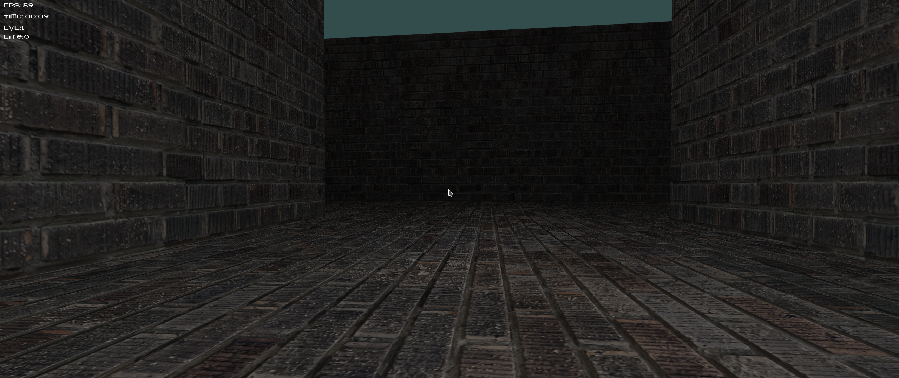

## HW4

This is the script for HW4 of Fundamentals of Computer Graphics I.

## Usage

    mkdir build
    cd build
    cmake ..
    make
    ./hw4

Dependencies: FreeType Font

wooow

Apply one day more to write README and do a little ending work.

Algorithm Exam is coming.
