# HW4

This is the script for HW4 of Fundamentals of Computer Graphics I.

## Usage

    mkdir build
    cd build
    cmake ..
    make
    ./hw4

Dependencies: FreeType, GLFW, GLM, GLEW

3rd Part libraries: SOIL, ASSIMP

## Introduction

This program implements a simple 3D maze game. Player must find the existence of the maze. There is no hard time limit for each round. However, player will lose HP gradually and finally lose game if he does not find the existence in the soft time limit.

In a maze, there are five keys and five doors. They are five elements that the world is comprised of: Metal, Wood, Water, Fire and Earth.

 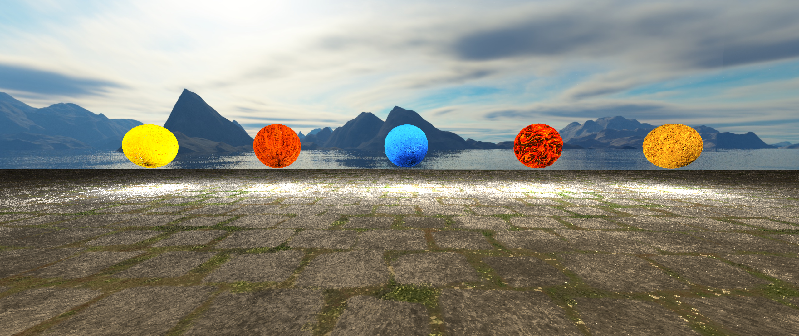

 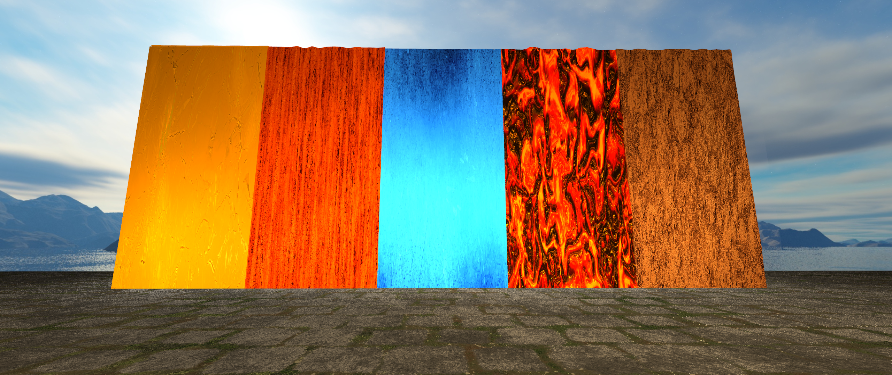

 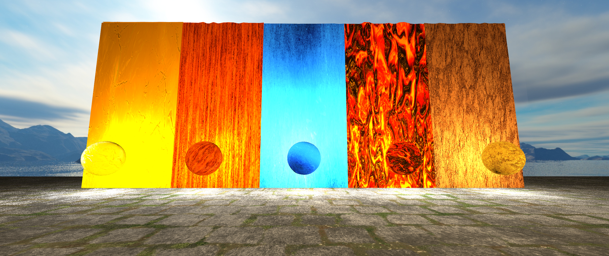

The in-game scenario is much dark. Player has a flashlight, which can be turned on/off by `F` key. Player can move using `w` and `s` for forward and backward and `a` and `d` for left and right sidestepping. The speed of walking forward and backward is different. Player can hold `shift` to run when not walking backward and can jumpy by `space` key. View direction is controlled by mouse motion. All of these is just like normal first person game.

Besides for the five doors, there is also a back door in the maze. Player can directly go to next level through that door and do not need to collect any special item.

This game has a very simple on-screen GUI which indicates the basic game information. During game, press `esc` to pause game. 

A grid-based method is used to detect collision. No collision bug found so far.

## Trick

There is a trick to go through mazes. Mazes are generated using an invariant version of Prim's MST algorithm such that all cells in a maze are reachable and that no circle path exists. Therefore, the player can go through the maze by simply keeping walking along a side of walls. The maze can become much harder by randomly removing some walls after generated.

## Features

Some CG knowledge related freatures are listed below.

#### Multiple Lights

Besides the headlight located at the camera position, there is a point light at the center of each of the five key balls. Once the player collects any of them, then a lamp located right before the corresponding door will be lighted. (They are just the same point light but change the position and intensity.) This may help the player to find out the door sometime.

The headlight is not exactly at the position of the camera but a little higher, which makes the light eara looks not a real circle and more normally.

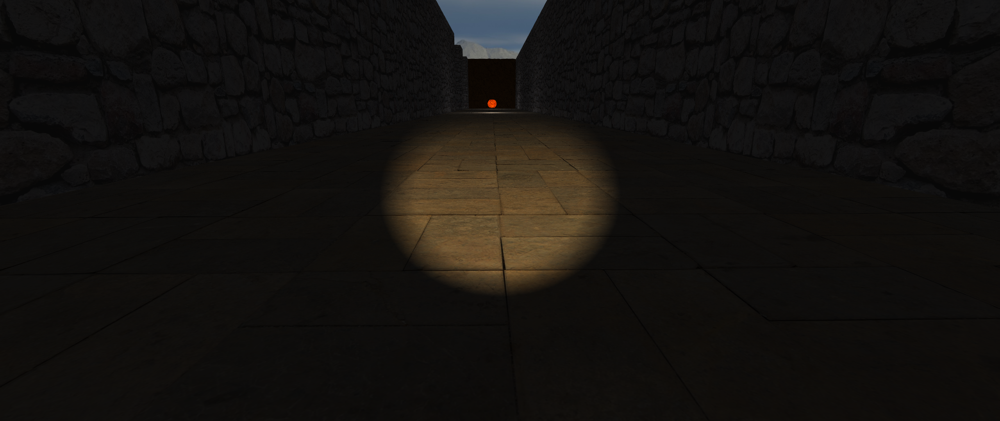

#### Smooth Jump

There are lots of excllent games that handle `jump` very awesomely. But, I think the `jump` I implements is not bad. The player has a little different ascending and descending speed. And, ascending and descending are finished `gradually` during multiple tricks. The player cannot change the movement direction during jumping but can move mouse to look at different directions. The player are allowed to performance continuous jumping by holding `space` key.

#### Sky Box

A very common texture found on the internet.

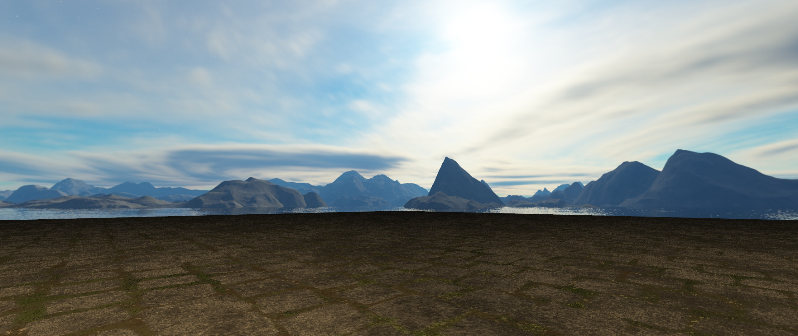

#### Diffuse/Normal/Specular/Displacement/Parallel Mapping

Diffuse, normal and specular mappings are used for every object rendering. Walls and floors are rendered using parallel mapping. Keys and doors are rendered using displacement mapping. UV mapping are generated using blender.

 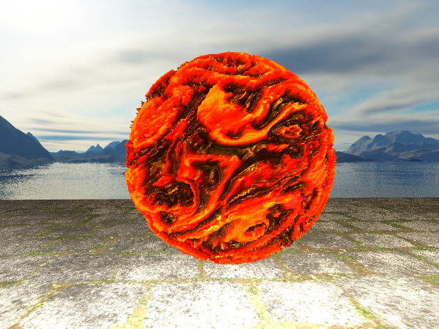

#### Realtime CG Moive

A very simple movie you will see, if you reach any of the five doors with the corresponding key.

#### GUI

A very simple GUI with a pause screen and loading screen. Scene before pausing will be rendered into buffers such that the pause screen has a Gaussian blurred scene as background.

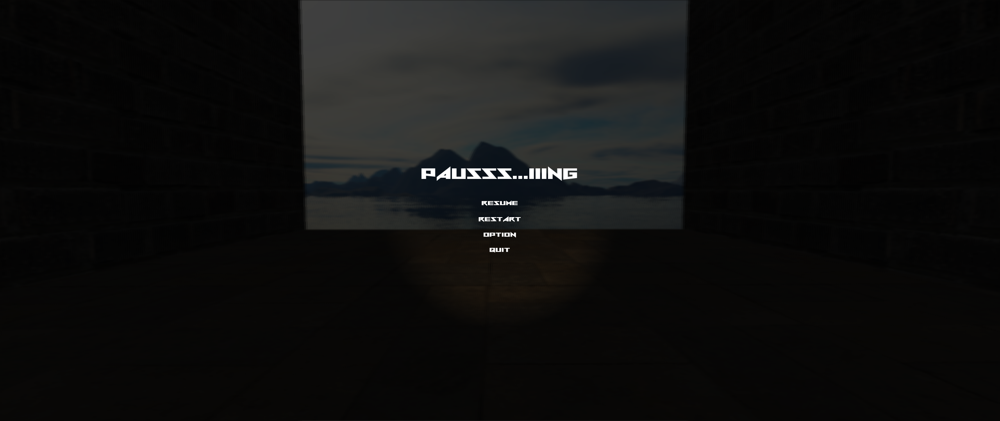

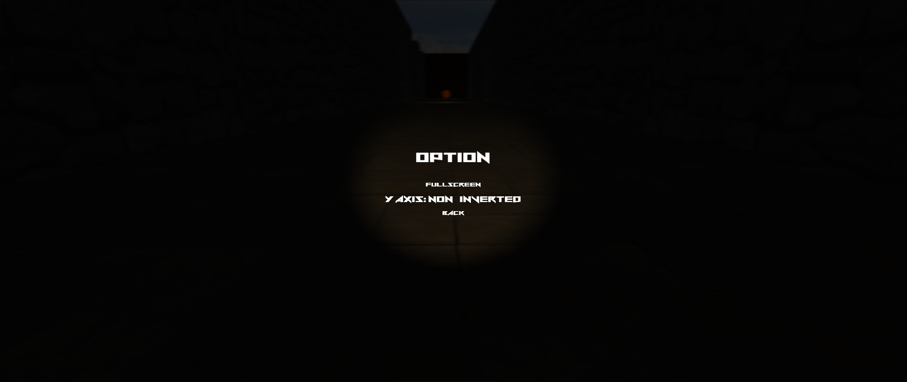

## Gallery

A Light in the Dark

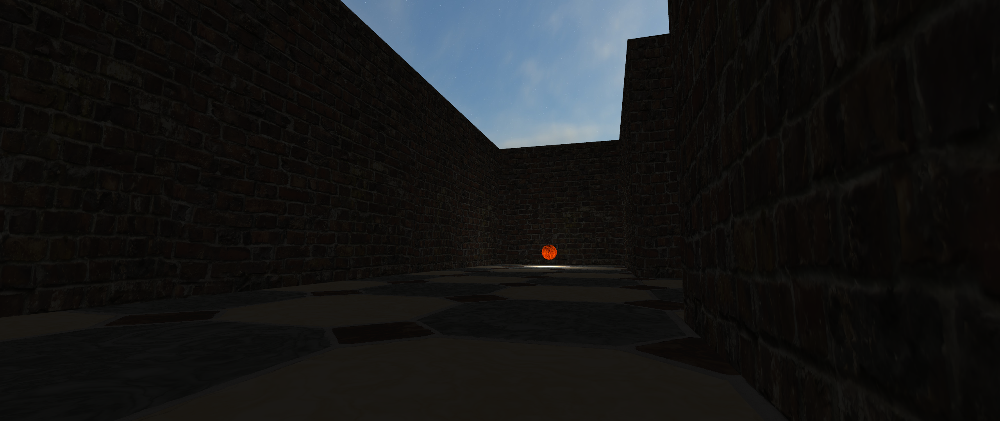

Water Spirit Ball

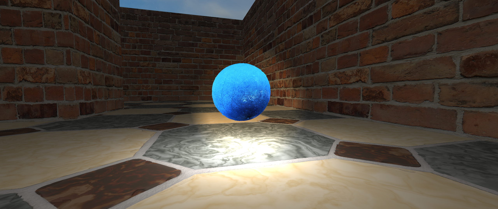

Metal Spirit Ball

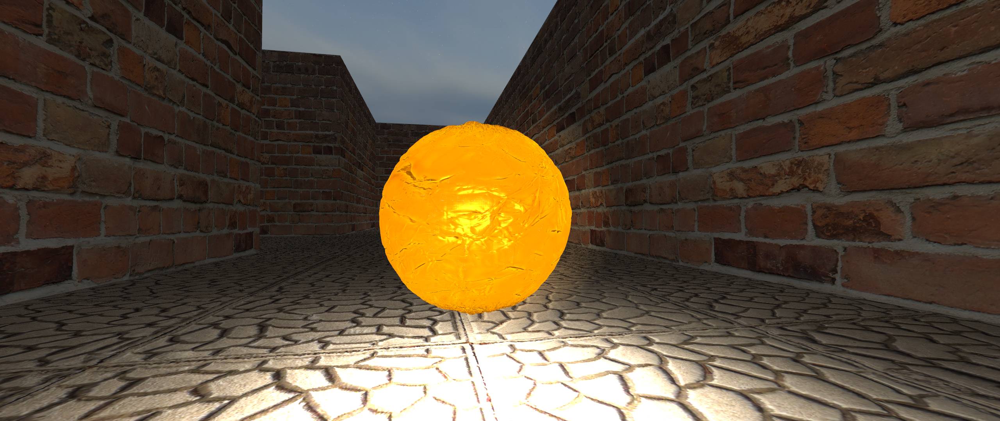

Fire Spirit Ball

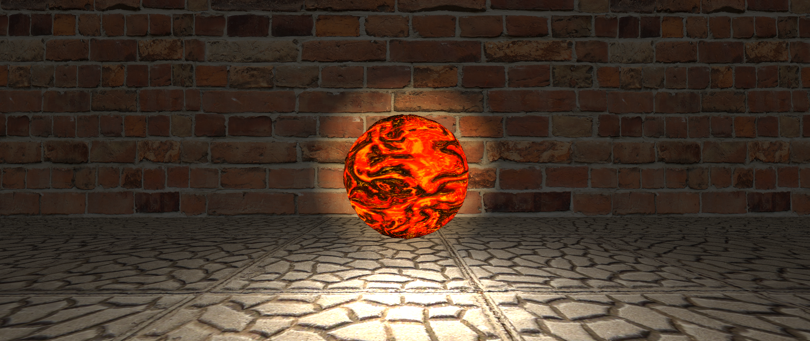

Lighted Door (have got the key for the door)

Unlighted Door (not get the key yet)

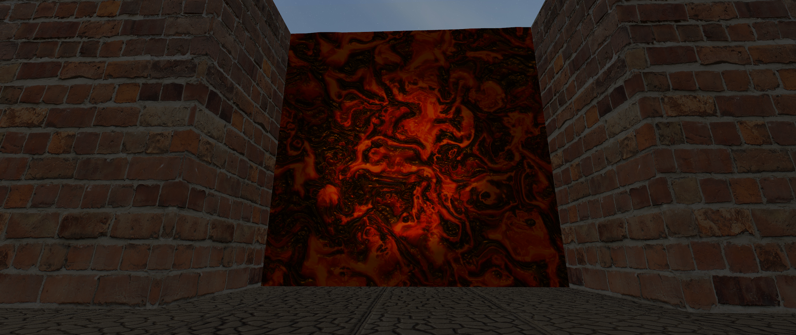

Another Lighted Door

The Backdoor

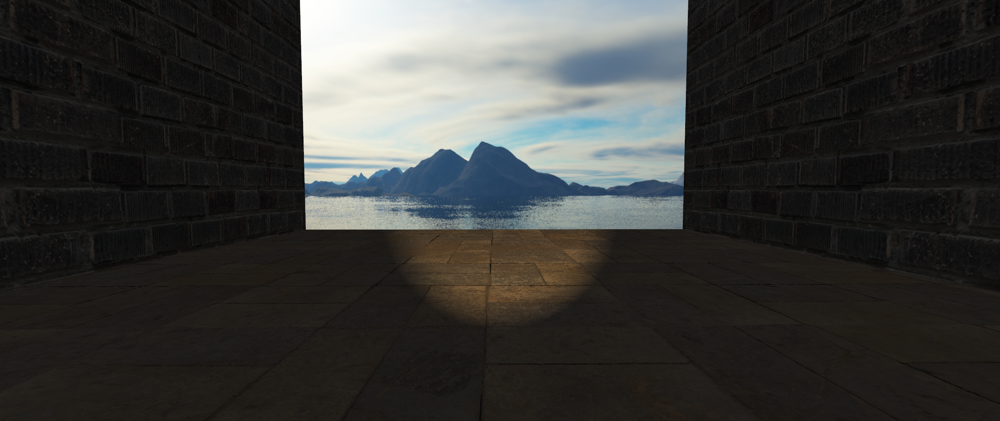

Failed Parallel Mapping

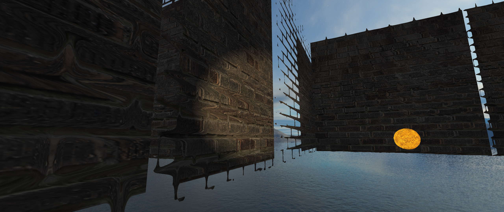

Some Details

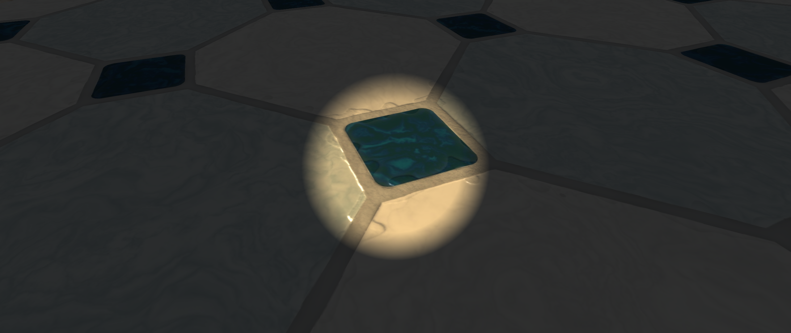

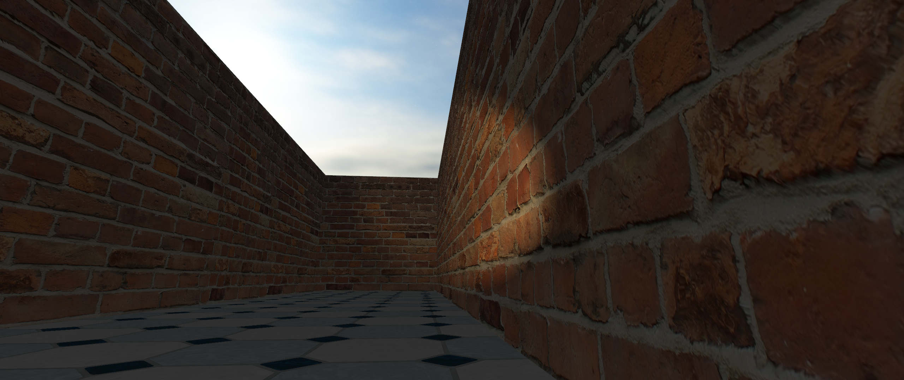

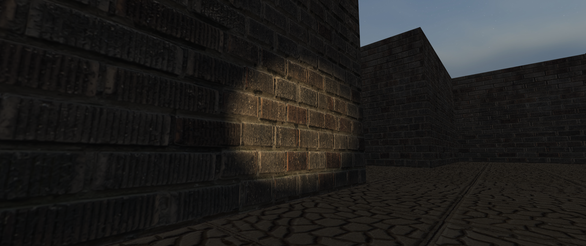

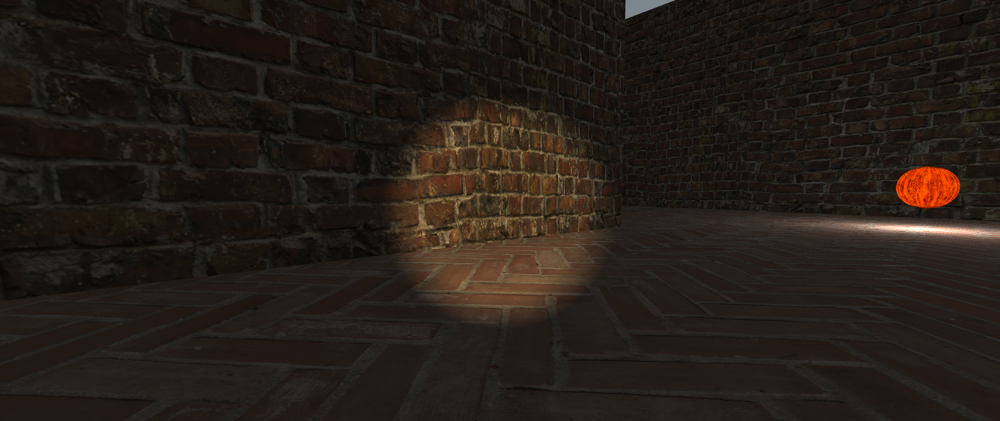

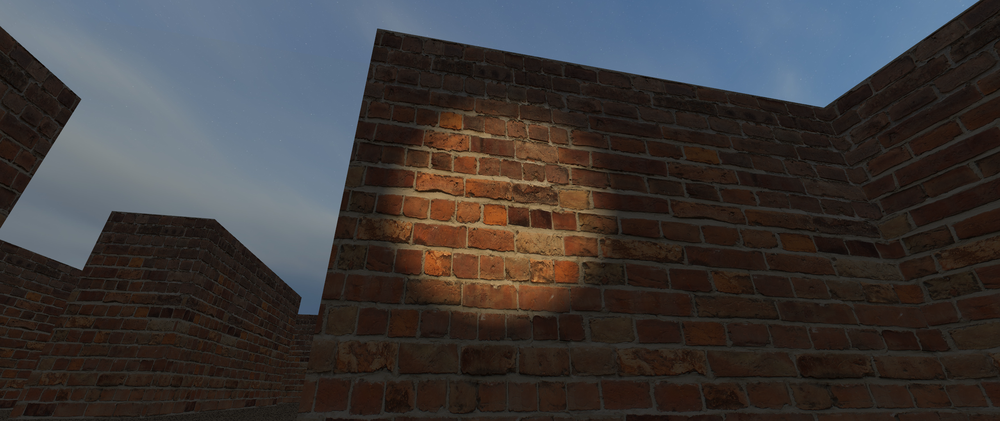

## Video Demo

https://youtu.be/xlU0dKPmWVQ

## Copyright Declaration

There are some copyrighted texture files included in this homework. If anyone has intention to collect or use these files, please visit https://3dtextures.me/ but not directly download them in this repository.

